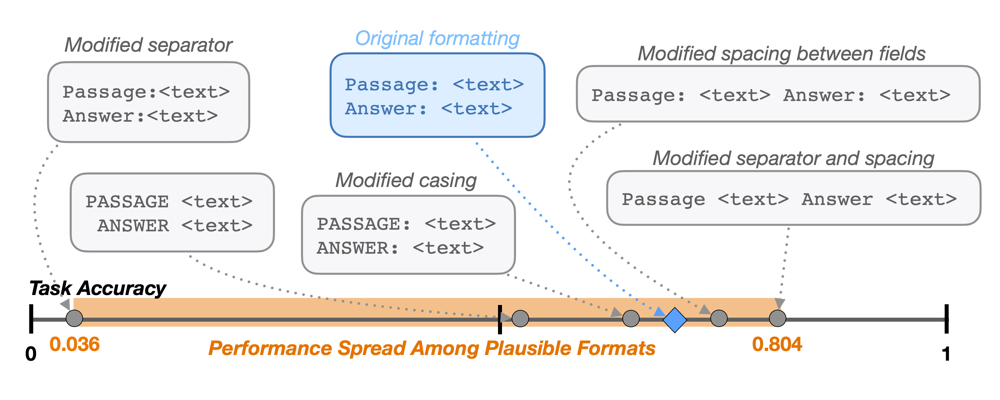

# FormatSpread _or: How I learned to start worrying about prompt formatting_



Prerequisites: download [natural-instructions](https://github.com/allenai/natural-instructions) and [instruction-induction](https://github.com/orhonovich/instruction-induction).

Dump of all package versions used is stored in `pip_list.txt`. Many packages may not be necessary to run this code.

## Executing FormatSpread and full evaluation of all candidates

`main.py` runs N+1 formats (N + original format) for a specific task. The formats are generated once and then reused for all future calls with the same `--num_formats_to_analyze` for a specific task, which ensures that all models are evaluated under the same set of formats. Evaluation (`--evaluation_metric`) may be done through string matching (`exact_prefix_matching`) or ranking between valid options (`probability_ranking`).

**Example script for fully evaluating** `task158` from SuperNatural Instructions on 10 formats (9 + original) using 1-shot GPT3.5. The dataset will be reduced to 1000 samples:
```
python main.py \
    --task_filename task158_ \
    --dataset_name natural-instructions \
    --num_formats_to_analyze 9 \
    --batch_size_llm 2 \
    --num_samples 1000 \
    --model_name "gpt-3.5-turbo" \
    --n_shot 1 \
    --evaluation_metric exact_prefix_matching \
    --evaluation_type full
```

**Example command for evaluating 5-shot LLaMA-2-70B** on task158 from SuperNaturalInstructions using bits and bytes (`--use_4bit`) to be able to run the model on a single A100. **This command uses FormatSpread** (with 320 formats, B=20, E=40000) and ranking multiple choice options as accuracy metric. 

Setting `--num_formats_to_analyze 499` ensures usage of the set of selected 500 formats as defined in `data/holistic_random_sample_task158_nodes_499_textdisabled.json`, which users may want to share with other runs.
```
python main.py \
    --task_filename task158_ \
    --dataset_name natural-instructions \
    --num_formats_to_analyze 499 \
    --batch_size_llm 2 \
    --num_samples 1000 \
    --model_name "meta-llama/Llama-2-70b-hf" \
    --use_4bit \
    --n_shot 5 \
    --evaluation_metric probability_matching \
    --evaluation_type format_spread \
    --num_formats_format_spread 320 \
    --batch_size_format_spread 20 \
    --budget_format_spread 40000
```

## Adding new tasks

Our scripts were generated to parse SuperNatural Instructions (`--dataset_name natural-instructions`) and Instruction Induction (`--dataset_name instruction-induction`) tasks. 

If you want to run your own task, make the appropriate changes in data_loading.py using Instruction Induction as guidance. For reference of commonly used formats, refer to functions `_one_text_field()` and `_two_text_field()`.

SuperNatural Instructions has some very complex formats that require using some extra params. We will add a tutorial (and simplify code) for them in the near future. **Feel free to submit an issue if it is unclear to you how to should parse a specific format!**

### Evaluating on other models

Modify `_load_model()` accordingly. Current load model function is extremely hacky :)

## Paper Citation

If you found the paper or datasets helpful, consider citing it:

```
@article{sclar2023quantifying,
  title={Quantifying Language Models' Sensitivity to Spurious Features in Prompt Design or: How I learned to start worrying about prompt formatting},
  author={Sclar, Melanie and Choi, Yejin and Tsvetkov, Yulia and Suhr, Alane},
  journal={arXiv preprint arXiv:2310.11324},
  year={2023}
}
```
